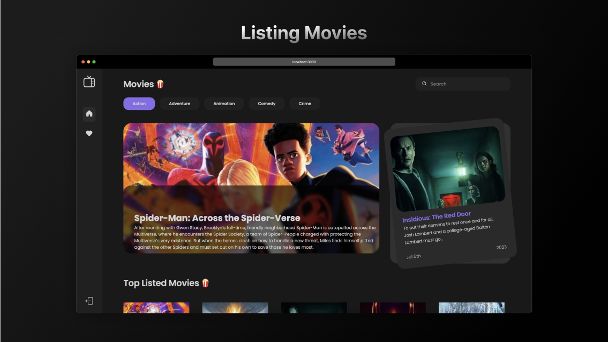
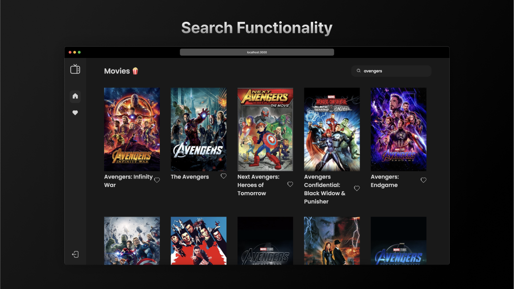
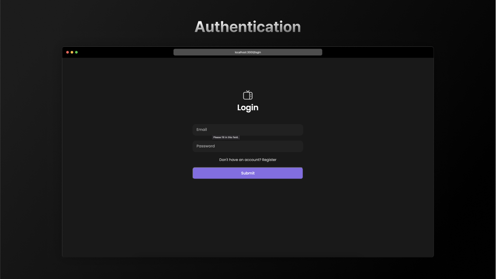
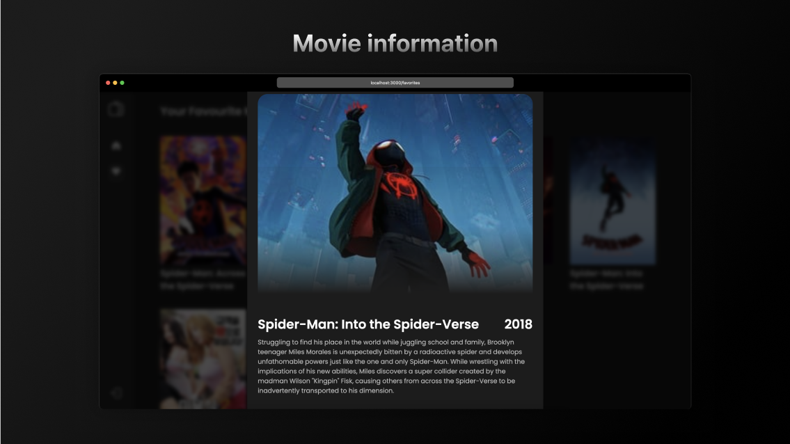
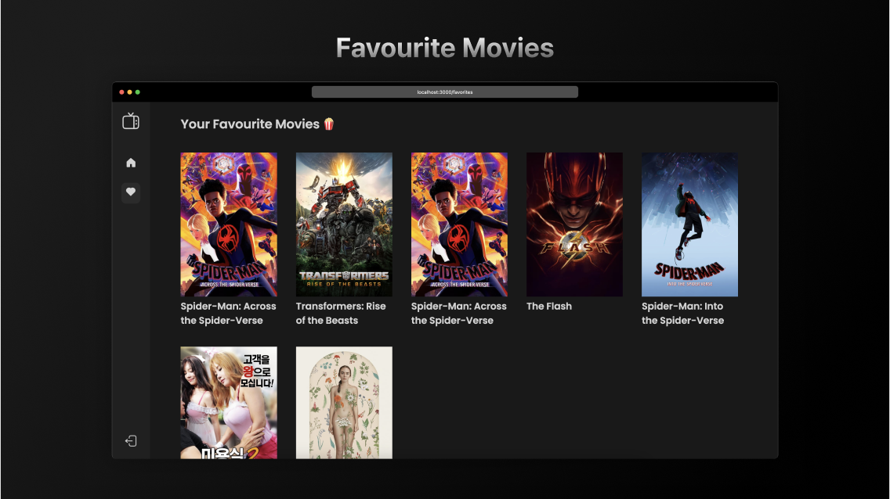

# Movie Hub Full stack App

## Screenshots







## Installation guide (Frontend)

Clone the repo

```bash
 git clone https://github.com/DhairyaMarwah/omnify_assessment.git
```


CD into client directory

```bash
 cd client
```


Install the dependencies

```bash
 yarn
```

Start the server

```bash
 yarn start
```


## Installation guide (Backend)


CD into Backend directory

```bash
cd backend2
```

create a source environment

```bash
python3 -m venv myvenv
```

activate it

```bash
source myvenv/bin/activate
```

cd into movie_backend

```bash
cd movie_backend
```
 
 install the dependencies

```bash
pip install -r requirements.txt
```

 run the server

```bash
python manage.py runserver
```
 
## NOTE
The frontend server must be opened on port :3000 & backend on port :8000
